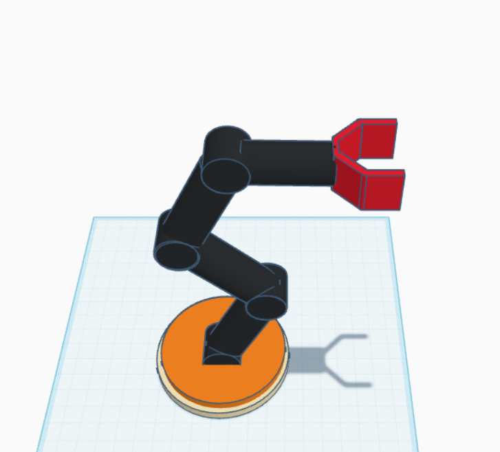

# Robotic Arm - 5 Degrees of Freedom (5 DOF)

This project showcases a 3D model of a robotic arm with 5 degrees of freedom, designed using Tinkercad. The arm is composed of a rotating base, two articulated arm segments, a wrist rotation joint, and a two-fingered gripper mechanism.

---

## Features

-  Base rotation (DOF 1)
-  Lower arm pitch (DOF 2)
-  Upper arm pitch (DOF 3)
-  Wrist rotation (DOF 4)
-  Gripper open/close (DOF 5)

---

## Files

- `robotic_arm_5dof.stl` – 3D model file of the full robotic arm in STL format
- `robotic_arm_preview.png` – Image preview of the robotic arm design

---

##  How to Use

1. Download the `.stl` file from this repository.
2. Open it in any 3D viewer, slicing software (like Cura), or CAD tool (like Fusion 360).
3. Simulate the structure or prepare for 3D printing.
4. You can also analyze the DOF and use it for educational or robotics prototyping purposes.

---

##  License

This project is currently not licensed.  
If you'd like to use or modify this work, please contact the creator or give credit appropriately.

